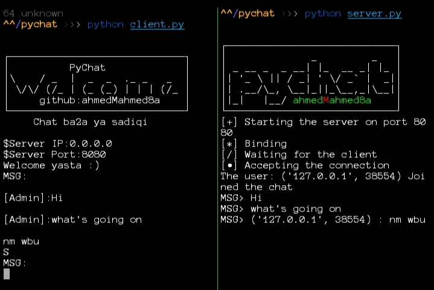

# Pychat

Pychat is a simple chatting script written in python 

## Content:

there's two files :
### client.py

 Client side of the script

### server.py

Server side of the script

## Installation
simply clone this repo 

```
git clone https://github.com/Ahmedmahmed8a/pychat
```

## Usage
open the repo's directory
```
cd pychat
```
## Server command
then start the server
```
python3 server.py
```
get your ip address for using it for client .
### Note: 
 The default port is 8080 
## Client command
```
python3 client.py
```
## Contributing
Pull requests are welcome. For major changes, please open an issue first to discuss what you would like to change.

Please make sure to update tests as appropriate.
